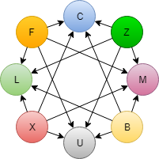

  

# HATEOAS sandbox

This repository is a sandbox for different implementations of [HATEOAS](https://en.wikipedia.org/wiki/HATEOAS).

## Domain model

Imagine there to be a site where you as an author can post articles. You can also read articles from other authors and collaborate by posting comments to those articles.

The following graph describe the relations between authors, articles and comments.

## Implementations

The following implementations currently exist in this repository:

- [.NET Core backend with the HAL-browser as client](./src/hal/dotnet-and-hal-browser)