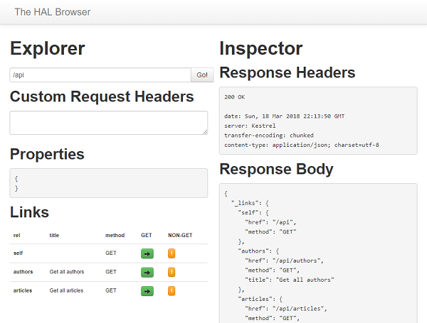

# .NET Core backend with the HAL-browser as client

## Running the code

Run the following commands in Bash or PowerShell.

```bash
docker build -t hal-dotnet .
docker run -p 8080:80 hal-dotnet
```

When the container is running hit [http://localhost:8080/#/api](http://localhost:8080/#/api) with your favorite web browser and you'll be presented with the following view.

